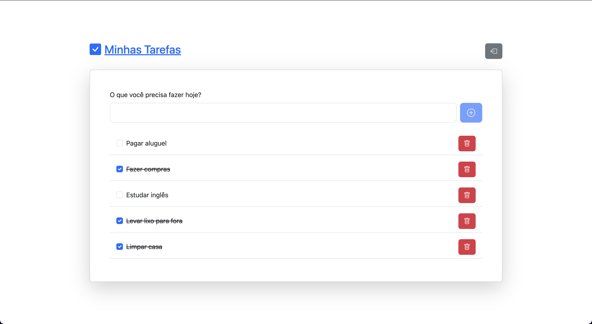

<h1 align="center">
  Minhas Tarefas
</h1>

<p align="center" style="margin-right: 8px">
  
</p>

## 💻 Sobre o projeto

> Foi desenvolvido também o **backend Minhas listas**. Se quiser olhar como ficou [clique aqui](https://github.com/kassiosilva/api-todo-list).

Esse front end traz todas as principais funcionalidades de uma lista de tarefas, além de se comunicar com uma API REST para para salvar suas tarefas. Este sistema foi feito como trabalho final da disciplina de desenv plataformas web.

## ⚙️ Funcionalidades

- Apresentação da aplicação (Landing Page)

  

- Criação de usuários

  

- Autenticação de usuários via JWT

  

- Autenticado você é redirecionado para a dashboard onde estará listado suas tarefas. Você pode adicionar, remover e marcar como concluído as tarefas.

  

## 🛠 Tecnologias

As seguintes ferramentas foram usadas na construção do projeto:

- React com Vite
- React Router Dom
- Bootstrap
- Axios
- React Query
- Sonner (para toast notifications)

## 🚀 Como executar o projeto

> A aplicação consome uma API. Para o funcionamento correto, instale e configure a API primeiro. [Clique aqui para o passo a passo](https://github.com/kassiosilva/api-todo-list).

Clone o projeto e depois de baixado entre na raiz do projeto e execute:

```bash
  npm install
```

Como falado anteriormente, você precisa rodar o backend feito para essa aplicação para o funcionamento correto. Defina um arquivo `.env.local` na raiz do projeto e copie todas as variavéis do `.env.local.example`.

```
VITE_API_URL="Defina a url do backend local aqui"
```

Feito isso, execute o comando na raiz:

```bash
npm run dev
```

Se tudo estiver certo, o frontend irá iniciar 🚀
